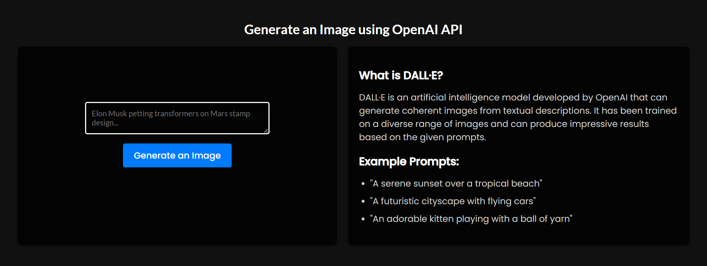

# Project Title

DALL·E Image Generator

<br>



<br>

## Table of Contents

- [Introduction](#introduction)
- [Features](#features)
- [Installation](#installation)
- [Usage](#usage)
- [License](#license)
- [Contact](#contact)

## Introduction

The DALL·E Image Generator is a web application that utilizes the OpenAI API to generate images based on textual prompts. It leverages the power of the DALL·E model to create visually appealing and coherent images from simple descriptions.

## Features

- Enter a prompt and generate an image based on the provided text.
- View the generated image in the application.
- Clear the prompt and generate a new image.

## Installation

1. Clone the repository:
```git clone https://github.com/your-username/dalle-image-generator.git```

2. Navigate to the project directory:
```cd dalle-image-generator```

3. Install the dependencies:
```npm install```
4. Set up your OpenAI API key by creating a `.env` file in the root directory and adding the following line:
```VITE_Open_AI_Key=your-openai-api-key```
5. ```npm run```

## Usage

1. Enter a prompt in the text area provided.
2. Click the "Generate an Image" button to generate an image based on the prompt.
3. The generated image will be displayed below the button.
4. You can clear the prompt and generate a new image by clicking the button again.

## License

This project is licensed under the [MIT License](LICENSE).

## Contact

For any inquiries or support, please contact me at [jeevaa.exe@gmail.com](mailto:jeevaa.exe@gmail.com).
